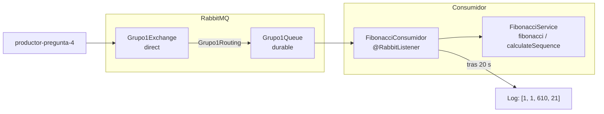

# consumidor-pregunta-4 - Consumidor RabbitMQ

Evaluacion T1 del curso **Desarrollo de Aplicaciones Web II**  
Instituto Superior Tecnologico Cibertec  
Grupo 1

---

## Integrantes del Grupo

| N° | Apellidos y Nombres | Grupo |
|:--:|---------------------|:-----:|
| 1 | Chaupis Alvarez Jhonny Samuel | 1 |
| 2 | Hinojosa Cano Carlos Daniel | 1 |
| 3 | Hurtado Sernaque Brayan Luis | 1 |
| 4 | Alayo Oliveros Mathias Miller | 1 |

---

## Descripcion del Proyecto

Microservicio en Spring Boot que escucha la cola `Grupo1Queue` de RabbitMQ, convierte el mensaje recibido
(numeros separados por `;`) a una lista de enteros, calcula el valor de Fibonacci de cada posicion con
`FibonacciService`, realiza una pausa de 20 segundos e imprime el resultado. Los mensajes los publica el
proyecto `productor-pregunta-4`.

---

## Entorno y Requisitos Tecnicos

- **Lenguaje:** Java 25
- **Framework:** Spring Boot 4.1.1
- **Librerias principales:** Spring AMQP, Lombok
- **Gestor de construccion:** Apache Maven 3.9+ (o Maven Wrapper incluido)
- **Broker:** RabbitMQ en `localhost:5672` (`guest` / `guest`)
- **Puerto configurado:** 10112

---

## Listener y Contrato RabbitMQ

- **Cola escuchada:** `Grupo1Queue` (durable)
- **Exchange:** `Grupo1Exchange` (direct)
- **Routing key:** `Grupo1Routing`
- **Formato del mensaje:** `String` plano, por ejemplo `1;2;15;8`
- **Flujo del listener:**
  1. Recibe `cadenaNumeros` con `@RabbitListener(queues = RabbitMqConfig.QUEUE)`.
  2. Convierte el texto a `Integer[]` con `Stream.of(cadenaNumeros.split(";"))`.
  3. Llama a `fibonacciService.calculateSequence(lista)`.
  4. Pausa de 20 segundos con `Thread.sleep(20000)`.
  5. Imprime cada `fibonacci(n)` y la lista resultante.
- **Componentes:**
  - `FibonacciConsumidor`: Listener de la cola.
  - `FibonacciService`: Calculo de Fibonacci con cache (texto del enunciado).
  - `RabbitMqConfig`: Declara exchange, cola y binding como `@Bean` (misma topologia que el productor).

---

## Diagrama de Componentes



---

## Compilacion y Ejecucion

### Prerrequisitos

- Java Development Kit (JDK) 25 configurado en la variable `JAVA_HOME`.
- RabbitMQ levantado con el plugin de administracion (consola en `http://localhost:15672`).

### Pasos de Ejecucion

1. Clonar el repositorio:
```bash
git clone https://github.com/jmalayo-dev/consumidor-pregunta-4.git
cd consumidor-pregunta-4
```

2. Compilar el proyecto con Maven Wrapper:
- En entornos Unix (Linux / macOS):
```bash
./mvnw clean compile
```
- En entornos Windows:
```cmd
mvnw.cmd clean compile
```

3. Iniciar la aplicacion:
- En entornos Unix (Linux / macOS):
```bash
./mvnw spring-boot:run
```
- En entornos Windows:
```cmd
mvnw.cmd spring-boot:run
```

La aplicacion queda conectada a RabbitMQ escuchando la cola `Grupo1Queue`.

---

## Ejemplos de Prueba

**Sin productor:** en la consola de RabbitMQ, **Queues and Streams → Grupo1Queue → Publish message**:

- Properties: `content_type` = `text/plain`
- Payload: `1;2;15;8`

**Con productor:**
```bash
curl "http://localhost:10111/api/fibonacci/send?numbers=1%3B2%3B15%3B8"
```

---

## Resultados de las Pruebas

Pruebas realizadas el 27/09/2026 sobre un clon limpio del repositorio, junto con `productor-pregunta-4`.

| Prueba | Resultado |
|--------|-----------|
| Compilacion y test `contextLoads` (`./mvnw package`) | OK |
| Arranque con `./mvnw spring-boot:run` y conexion a RabbitMQ | OK |
| Topologia en RabbitMQ (`Grupo1Exchange` → `Grupo1Queue` con `Grupo1Routing`) | OK |
| Mensaje `1;2;15;8` | Resultado `[1, 1, 610, 21]` a los 20 s de recibido |
| Varios mensajes seguidos | Procesados de uno en uno, cada 20 s |

Log obtenido:

```
01:45:32 FibonacciConsumidor : Mensaje recibido de RabbitMQ: 1;2;15;8
01:45:52 FibonacciConsumidor : fibonacci(1) = 1
01:45:52 FibonacciConsumidor : fibonacci(2) = 1
01:45:52 FibonacciConsumidor : fibonacci(15) = 610
01:45:52 FibonacciConsumidor : fibonacci(8) = 21
01:45:52 FibonacciConsumidor : Resultado: [1, 1, 610, 21]
01:45:52 FibonacciConsumidor : Mensaje recibido de RabbitMQ: 1;2;15;8
01:46:12 FibonacciConsumidor : Resultado: [1, 1, 610, 21]
```
